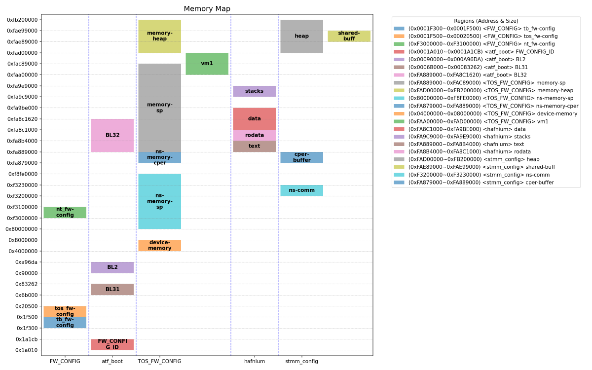
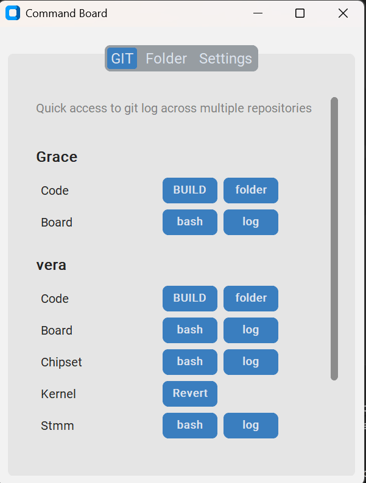

# AI Generated Tools

A collection of practical utilities primarily generated with AI assistance to solve specific development needs.


### Usage Instructions

Installing Dependencies
```bash
pip install -r requirements.txt
```

Running Tools
```bash
python <tool_name>.py
```

# Tools List

### Memory Map Visualizer
**File**: `memory_map_visualizer.py`

A tool for generating and visualizing memory layout mappings, particularly useful in firmware development.



**Usage**:
```bash
python memory_map_visualizer.py -f memory_map_visualizer.csv 
```

---

### Action Panel (GUI Launcher)
**File**: `action_panel.py`

A quick action launcher for multiple repositories and folders, supporting Git logs, Git Bash, helper scripts, and folder opening, all driven by a JSON config.



**Usage**:
```bash
python action_panel.py actions_config.json
```

---

# Private Tools
A set of private utilities for internal use.  

---
Search Commit Messages Across Repositories
```bash
python search_commit_msg.py IBxxxx0001
```

---
Reordering module order in the build report
```bash
python reorder_buildreport.py Report1.txt Report2.txt
```

---